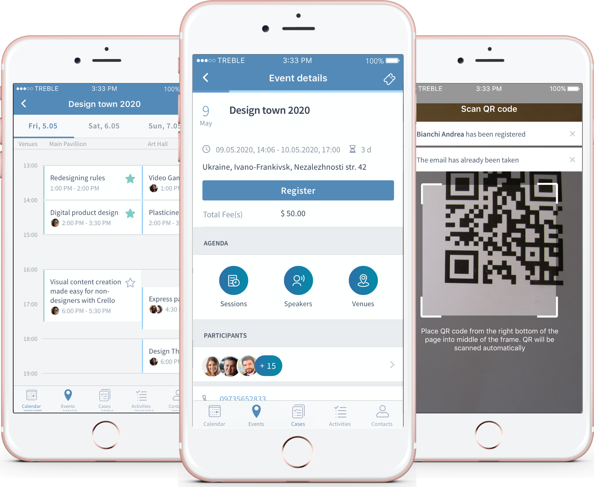

# CiviMobileAPI

The **CiviMobileAPI** extension is a CiviCRM component that allows to use a mobile application [CiviMobile](https://civimobile.org).

[CiviMobile](https://civimobile.org) is a native mobile application granting CiviCRM users immediate, secure and high-speed connection to CiviCRM, so that they leverage the combined benefits of the software and their smartphones.

## 

[CiviMobile](https://civimobile.org) Features:

- **Graphical Calendar** - displays all the schedule information in a graphical calendar on the dashboard.
- **Contacts** - ability to view the list of contacts in the system, add new and sync them to contact book on user device. Contact information is editable and includes a variety of options, like several phone numbers, websites, social media profiles, etc. The app supports custom fields that are configured in CiviCRM.
- **Groups and Tags** - ability to organize the contacts by adding tags and creating contact groups.
- **Membership** - users can access and renew their membership.
- **Contributions** - access to the history of all contributions, aggregated total and average payments.
- **Relationships** - users can create a relationship between oneself and other individuals or organizations and optionally set a start date and end date for the relationship.
- **Events &amp; Registration** - ability to filter all the available events by type, date or title, check the event description, register yourself or others for the chosen event, view past and future events, share the information about events, and view events&#39; locations on the map.
- **Event Agenda** - supports multitrack event schedule with multiple sessions, speakers and venues. There is ability to view session and speaker details as well as mark favorite sessions.
- **Participants Management &amp; Check-In** - ability to view and manage event participants and their statuses. Additionally, a user can use Check-In functionality to mark participants who have attended an event while an built-in QR scanner will make this process fast and reliable.
- **Payment** - ability to register for paid events and renew membership directly through the app.
- **Navigation** - users can switch to map navigation to easily find a direction to the location (e.g. a branch office or an event location).
- **Cases** - immediate access to cases details; ability to change the status of the case.
- **Activities** - access user&#39;s activities details; ability to add, edit and assign activities.
- **Push-notifications** - notifications about the updates in the system are displayed on the dashboard of the mobile phone.
- **Public Area** - supports user account setup in CiviCRM, public events view and registration for unauthenticated users.
- **News** – RSS feed reader keeps users informed about latest news updates organization shares.
- **Surveys** – ability to conduct surveys with all updated survey details, walk lists, respondent statuses at hand and data available for analysis in real-time.
- **Petitions** – support a broader campaign by engaging registered and unregistered users to sign a petition within the app.
- **Working Offline** - can work in the offline mode.
- **Settings** - users can configure a set of parameters customizing the view and work of the application.
- **9 locales** - supports: English, German, French, Italian, Spanish, Dutch, Hungarian, Polish and Ukrainian.

More details about how to install CiviMobileAPI extension and start using CiviMobile can be found at official CiviMobile website [https://civimobile.org](https://civimobile.org).

Also, our step-by-step videos will lead you through the process of installing the CiviMobileAPI on [Drupal](https://www.youtube.com/watch?v=jNVMLSfU1ug), [Joomla](https://www.youtube.com/watch?v=mli8HkxVu60) and [WordPress](https://www.youtube.com/watch?v=mDjHEglfVT4&t=4s).

The latest CiviMobile application can be downloaded from [AppStore](https://itunes.apple.com/us/app/civimobile/id1404824793?mt=8) of [Google PlayMarket](https://play.google.com/store/apps/details?id=com.agiliway.civimobile), which should be accessed from the mobile devices of users.


## Requirements

- CiviCRM v5.14.x+
- PHP v5.4+
- Drupal 7.x, 8.x
- Joomla 3.x (CiviCRM 5.1+)
- WordPress 4.8+

*WordPress API patch is required. Please install ["CiviCRM WP REST API Wrapper" plugin](https://github.com/mecachisenros/civicrm-wp-rest) or [contact us](mailto:civicrm@agiliway.com) for details.

## Installation (git/cli)

To install the extension on an existing CiviCRM site:

```
cd sites/default/files/civicrm/ext
git clone https://lab.civicrm.org/extensions/civimobileapi.git com.agiliway.civimobileapi
```

1. Install it within the CiviCRM Extensions tab of the administration panel:

- go to Administer -> System Settings -> Extensions
- Click on Install button for CiviMobileAPI extension

2. Clear the cache:

- Administer -> System Settings -> Cleanup Caches and Update Paths

3. Install CiviMobile app into your smartphone from App Store or Google Play Market

4. Open the app on your device and enter the same login information you use for a web version (username and password) and your CiviCRM website URL – a URL you enter to access your CiviCRM system

5. If you get an error after installing CiviMobileAPI extension please visit: ["CiviMobile FAQ"](https://civimobile.org/faq/)
